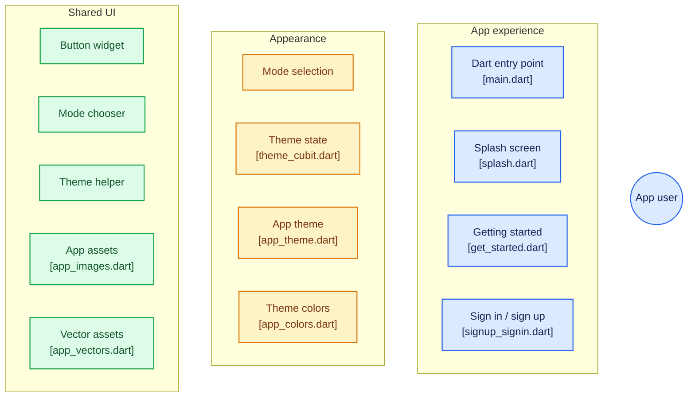

# 🎵 Music App - Flutter

Ứng dụng nghe nhạc hiện đại được phát triển bằng Flutter, áp dụng kiến trúc phân tầng rõ ràng, quản lý trạng thái với **BLoC / HydratedBloc**, hỗ trợ chuyển đổi giao diện sáng/tối (Light/Dark Mode) mượt mà và hệ thống thành phần UI tái sử dụng.

---

## 📌 Mục lục
- [Giới thiệu dự án](#-giới-thiệu-dự-án)
- [Kiến trúc & Luồng ứng dụng](#-kiến-trúc--luồng-ứng-dụng)
  - [Sơ đồ Mermaid Flowchart](#sơ-đồ-mermaid-flowchart)
  - [Mô tả chi tiết các phân hệ](#mô-tả-chi-tiết-các-phân-hệ)
- [Cấu trúc thư mục](#-cấu-trúc-thư-mục)
- [Công nghệ & Thư viện sử dụng](#-công-nghệ--thư-viện-sử-dụng)
- [Hướng dẫn cài đặt & Khởi chạy](#-hướng-dẫn-cài-đặt--khởi-chạy)

---

## 📖 Giới thiệu dự án

**Music App** là dự án ứng dụng nghe nhạc di động được thiết kế với giao diện người dùng hiện đại, tinh tế. Dự án tập trung vào:
- **Trải nghiệm khởi động mượt mà:** Từ màn hình Splash Screen, Getting Started cho đến Đăng nhập/Đăng ký.
- **Hệ thống Theme linh hoạt:** Lưu trữ trạng thái Light/Dark Mode bền vững với `hydrated_bloc` mà không lo mất trạng thái khi khởi động lại ứng dụng.
- **Design System đồng nhất:** Định nghĩa bộ mã màu (`AppColors`), font chữ đặc trưng (`ClashDisplay`, `Satoshi`), hình ảnh và vector SVG dùng chung.

---

## 🏗 Kiến trúc & Luồng ứng dụng

### Sơ đồ Mermaid Flowchart

Sơ đồ dưới đây mô tả luồng trải nghiệm của người dùng, phân hệ giao diện (Appearance) và các thành phần dùng chung (Shared UI). Các khối trong sơ đồ có thể bấm trực tiếp để chuyển tới mã nguồn tương ứng trên GitHub.



### Mô tả chi tiết các phân hệ

1. **Trải nghiệm ứng dụng (App Experience)**:
   - [`main.dart`](https://github.com/thiendat2004/music/blob/master/lib/main.dart): Điểm khởi chạy của ứng dụng, khởi tạo bộ nhớ đệm `HydratedStorage` và cấu hình `BlocProvider`.
   - [`SplashPage`](https://github.com/thiendat2004/music/blob/master/lib/presentation/splash/pages/splash.dart): Màn hình chào với logo hiển thị trước khi chuyển hướng.
   - [`GetStartedPage`](https://github.com/thiendat2004/music/blob/master/lib/presentation/intro/pages/get_started.dart): Màn hình giới thiệu ban đầu cho người dùng mới.
   - [`SignupOrSigninPage`](https://github.com/thiendat2004/music/blob/master/lib/presentation/auth/pages/signup_signin.dart): Điều hướng và lựa chọn xác thực người dùng.

2. **Quản lý giao diện & Chủ đề (Appearance)**:
   - [`ChooseModePage`](https://github.com/thiendat2004/music/blob/master/lib/presentation/choose_mode/pages/choose_mode_page.dart): Cho phép người dùng trực quan lựa chọn Light Mode hoặc Dark Mode.
   - [`ThemeCubit`](https://github.com/thiendat2004/music/blob/master/lib/presentation/choose_mode/bloc/theme_cubit.dart): Quản lý và lưu trữ `ThemeMode` dưới dạng JSON thông qua `HydratedCubit`.
   - [`AppTheme`](https://github.com/thiendat2004/music/blob/master/lib/core/configs/theme/app_theme.dart): Thiết lập cấu hình `ThemeData` hoàn chỉnh cho toàn ứng dụng.
   - [`AppColors`](https://github.com/thiendat2004/music/blob/master/lib/core/configs/theme/app_colors.dart): Bảng mã màu tiêu chuẩn (Primary Green, Dark Background, Light Background, Grey,...).

3. **Thành phần dùng chung (Shared UI & Resources)**:
   - [`BasicAppButton`](https://github.com/thiendat2004/music/blob/master/lib/common/widgets/button/basic_app_button.dart): Nút bấm tùy chỉnh đồng nhất cho toàn ứng dụng.
   - [`BasicChooseMode`](https://github.com/thiendat2004/music/blob/master/lib/common/widgets/chooseMode/basic_choose_mode.dart): Widget lựa chọn chế độ sáng/tối với hiệu ứng mờ kính (BackdropFilter).
   - [`is_light_theme.dart`](https://github.com/thiendat2004/music/blob/master/lib/common/helpers/is_light_theme.dart): Helper mở rộng (Extension) hỗ trợ kiểm tra nhanh chế độ hiển thị hiện tại.
   - [`AppImages`](https://github.com/thiendat2004/music/blob/master/lib/core/configs/assets/app_images.dart) & [`AppVectors`](https://github.com/thiendat2004/music/blob/master/lib/core/configs/assets/app_vectors.dart): Quản lý tập trung đường dẫn hình ảnh và icon định dạng SVG.

---

## 📂 Cấu trúc thư mục

Dự án được tổ chức theo cấu trúc module hoá, dễ dàng mở rộng và bảo trì:

```plaintext
lib/
├── common/                     # Các thành phần dùng chung toàn ứng dụng
│   ├── helpers/                # Tiện ích bổ trợ (is_light_theme.dart,...)
│   └── widgets/                # Các widget tái sử dụng (Button, ChooseMode,...)
├── core/                       # Cấu hình cốt lõi & Assets
│   └── configs/
│       ├── assets/             # Định nghĩa đường dẫn hình ảnh & vector (app_images, app_vectors)
│       ├── constants/          # Hằng số ứng dụng
│       └── theme/              # Định nghĩa Theme & Màu sắc (app_theme, app_colors)
├── data/                       # Tầng dữ liệu (Models, Data Sources, Repositories Implementation)
├── domain/                     # Tầng nghiệp vụ (Entities, Use Cases, Repositories Interfaces)
├── presentation/               # Tầng giao diện người dùng (UI & State Management)
│   ├── auth/                   # Màn hình & logic đăng nhập, đăng ký
│   ├── choose_mode/            # Màn hình & BLoC chọn chế độ sáng/tối
│   ├── intro/                  # Màn hình Getting Started
│   ├── splash/                 # Màn hình Splash khởi động
│   └── widgets/                # Widget phục vụ riêng cho tầng Presentation
└── main.dart                   # Entry point khởi tạo App & Bloc Providers
```

---

## 🛠 Công nghệ & Thư viện sử dụng

- **Flutter SDK**: `^3.13.4` (hoặc mới hơn)
- **Quản lý trạng thái (State Management)**:
  - [`flutter_bloc`](https://pub.dev/packages/flutter_bloc): Quản lý luồng sự kiện và trạng thái UI.
  - [`hydrated_bloc`](https://pub.dev/packages/hydrated_bloc): Tự động lưu trữ và phục hồi trạng thái BLoC vào bộ nhớ cục bộ.
- **Tài nguyên & Đồ hoạ (Assets & Graphics)**:
  - [`flutter_svg`](https://pub.dev/packages/flutter_svg): Kết xuất đồ họa vector mượt mà.
  - **Fonts**: Phông chữ cao cấp `ClashDisplay` và `Satoshi`.
- **Lưu trữ cục bộ (Storage)**:
  - [`path_provider`](https://pub.dev/packages/path_provider): Tìm kiếm thư mục lưu trữ cục bộ cho `HydratedStorage`.

---

## 🚀 Hướng dẫn cài đặt & Khởi chạy

### 1. Yêu cầu môi trường
- Đã cài đặt [Flutter SDK](https://flutter.dev/docs/get-started/install) (phiên bản tương thích Flutter 3.x).
- Android Studio / Xcode hoặc VS Code (đã cài đặt Flutter & Dart extensions).
- Thiết bị thật hoặc máy ảo (Android Emulator / iOS Simulator).

### 2. Các bước khởi chạy

1. **Clone repository về máy**:
   ```bash
   git clone https://github.com/thiendat2004/music.git
   cd music/music_dev_app
   ```

2. **Cài đặt các gói thư viện phụ thuộc**:
   ```bash
   flutter pub get
   ```

3. **Chạy ứng dụng**:
   ```bash
   flutter run
   ```

---

## 👨‍💻 Tác giả
- GitHub: [@thiendat2004](https://github.com/thiendat2004)